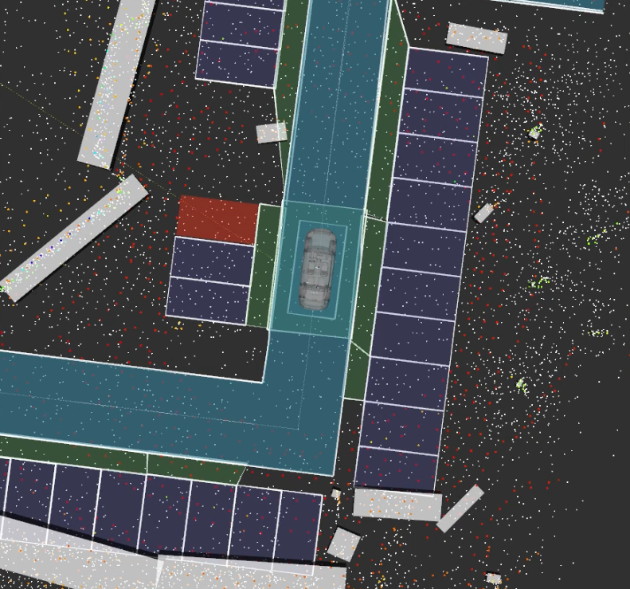

Starting and testing the behavior planner {#avp-demo-test-behavior-planner}
=======================================

# How to start the stack

The following instructions were tested on `origin/integration` with commit `492953d66414ac1dd9ec09e766bccbe56d24a88f`.

Start simulation as described [in the docs](https://autowarefoundation.gitlab.io/autoware.auto/AutowareAuto/lgsvl.html), then configure it properly

1. Maps: use this [map link](https://assets.dev.lgsvlsimulator.com/d5b8bb0b7f49875a8a4bbf83c50b3a4fe53779c7/environment_AutonomouStuff)
2. Vehicles: Select `ROS2 native` bridge type and paste content of `AutowareAuto/lgsvl-sensors.json` into the `Sensors` text box
3. Simulations: In `General` tab, `Select Cluster = Local Machine` and untick any boxes. In `Map & Vehicles` tab, ensure to untick `Run simulation in interactive mode`. In `Traffic` tab, untick all selection. `Weather` is irrelevant

*terminal 1*
```
> ade enter
ade$ cd AutowareAuto && source install/setup.bash # assumes all packages are already in install
ade$ /opt/lgsvl/simulator
# start sim according to instructions but don't drive away yet to make sure we can localize ourselves
```

*terminal 2*
```
> ade enter
ade$ cd AutowareAuto && source install/setup.bash
ade$ colcon build --packages-up-to autoware_auto_avp_demo
ade$ stdbuf -o L ros2 launch autoware_auto_avp_demo ms3_sim.launch.py
```

*terminal 3*
```
> ade enter
ade$ ros2 topic echo /planning/trajectory
```

Move the vehicle on LGSVL to the position shown in the image.


Send the goal to another parking spot by:

*terminal 4*
```
> ade enter
ade$ ros2 topic pub /planning/goal_pose geometry_msgs/msg/PoseStamped '{header: {frame_id: "map"}, pose: {position: {x: -95.875, y: 57.707, z: -1.950}, orientation: {x: -0.021, y: 0.014,z: 0.901,w: 0.434}}'} --once
```

## Verify that Behavior Planner recieves routes from Global Path
On Terminal 2, you should see following message output:

```
[behavior_planner_node_exe-19] [INFO] [planning.behavior_planner_node]: Received route
```

## Verify that Lane Planner and Parking Planner are called by Behavior Planner
On Terminal 2, you should see the following message output:

```
[behavior_planner_node_exe-19] [INFO] [planning.behavior_planner_node]: sent parking trajectory action goal
[behavior_planner_node_exe-19] [INFO] [planning.behavior_planner_node]: Recieved trajectory from planner
```

## Verify that Behavior Planner outputs a Trajectory for MPC to follow
On Terminal 3, you should see a trajectory message coming out from the behavior planner.
