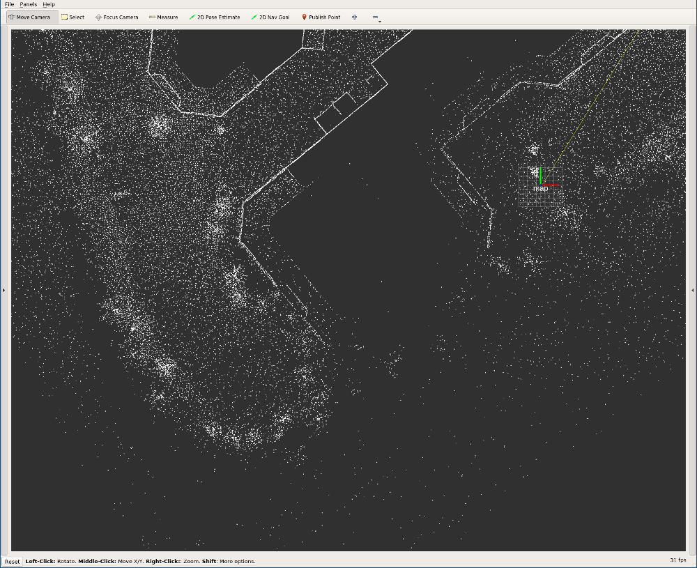
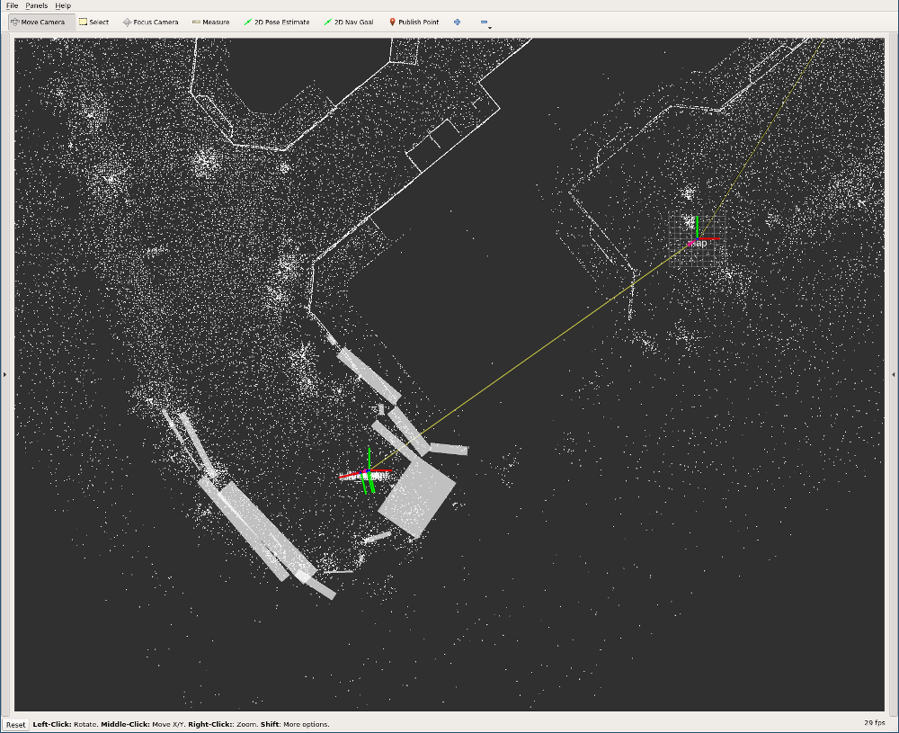

Initializing the NDT localizer {#avp-demo-test-ndt}
==============================

# Starting localization

* [Start LGSVL](https://autowarefoundation.gitlab.io/autoware.auto/AutowareAuto/lgsvl.html)
* Start `ms3_sim.launch.py`
* In RViz, select the `map` fixed frame, make sure the map and TF visualizations are enabled and you have a good top-down view
* Start the simulation (a "[localization.p2d_ndt_localizer_node]: For localization to start, please provide an initial pose in RViz." message is expected)
* In RViz, click on "2D pose estimation" and then click/drag on the position of the vehicle such that the arrow points in the same direction as the car
* You should now see a tf visualization (the red-blue-green axes) appearing at that location and the error messages stopping
* If your initial pose was good, you should be able to drive around in the simulator and see the `base_link` frame track the car's position

Here is what it should look like before you set the initial pose:

Here is what it should look like after, depending on which visualizations you have enabled (the important part are the colorful TF crosses for `odom` and `base_link`):

